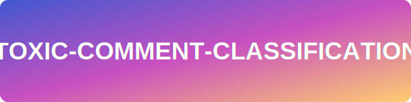

<p align="center">
  
</p>

<p align="center">
	<em>Turning Toxicity into Positivity with AI</em>
</p>
<p align="center">
	
	
	
	
</p>
<p align="center"><!-- default option, no dependency badges. -->
</p>
<p align="center">
	<!-- default option, no dependency badges. -->
</p>
<br>

## 🔗 Table of Contents

- [📍 Overview](#-overview)
- [👾 Features](#-features)
- [📁 Project Structure](#-project-structure)
  - [📂 Project Index](#-project-index)
- [🚀 Getting Started](#-getting-started)
  - [☑️ Prerequisites](#-prerequisites)
  - [⚙️ Installation](#-installation)
  - [🤖 Usage](#🤖-usage)
  - [🧪 Testing](#🧪-testing)
- [📌 Project Roadmap](#-project-roadmap)
- [🔰 Contributing](#-contributing)
- [🎗 License](#-license)
- [🙌 Acknowledgments](#-acknowledgments)

---

## 📍 Overview

The toxic-comment-classification project is a powerful tool designed to combat online toxicity. Leveraging advanced machine learning and deep learning models, it classifies comments as toxic or non-toxic, creating a safer digital environment. With features like data version control, automated task management, and a robust testing environment, it ensures consistency and reproducibility. This project is invaluable for online platforms seeking to enhance user experience by promoting respectful and positive interactions.

---

## 👾 Features

|      | Feature         | Summary       |
| :--- | :---:           | :---          |
| ⚙️  | **Architecture**  | <ul><li>The project is structured around a series of Jupyter notebooks, each serving a specific purpose in the data analysis and machine learning pipeline.</li><li>The `Makefile` serves as a central command hub, managing tasks such as setting up the Python environment, installing dependencies, and code linting.</li><li>The `setup.py` file facilitates the packaging and distribution of the software.</li></ul> |
| 🔩 | **Code Quality**  | <ul><li>The `tox.ini` file sets the coding style guidelines for the project, enforcing a maximum line length of 79 characters and a maximum complexity of 10.</li><li>The `test_environment.py` file ensures the correct Python interpreter is being used for the project.</li><li>The project uses a wide range of libraries for tasks such as HTTP handling, data manipulation, task scheduling, and more, as outlined in the `requirements.txt` file.</li></ul> |
| 📄 | **Documentation** | <ul><li>The project's primary language is Jupyter Notebook, with additional code written in Python, as indicated by the language counts.</li><li>The project's documentation includes install commands, usage commands, and test commands for both `tox` and `pip`.</li><li>The Jupyter notebooks serve as both code and documentation, allowing for interactive data exploration, analysis, and visualization.</li></ul> |
| 🔌 | **Integrations**  | <ul><li>The project integrates with `tox` and `pip` for package management, as indicated by the package managers.</li><li>The `data.dvc` file manages version control for the data directory in the project, tracking changes in the data files.</li><li>The project appears to have been run on a Google Colab environment with a T4 GPU, as per the colab metadata in one of the notebooks.</li></ul> |
| 🧩 | **Modularity**    | <ul><li>The project is modular, with different Jupyter notebooks serving different purposes in the data analysis and machine learning pipeline.</li><li>The `Makefile` enhances the project's modularity by automating routine tasks.</li><li>The `setup.py` file facilitates the packaging and distribution of the software, allowing for easy reuse and integration of the project's components.</li></ul> |
| 🧪 | **Testing**       | <ul><li>The `tox.ini` file sets the coding style guidelines for the project, aiding in maintaining code consistency and readability.</li><li>The `test_environment.py` file ensures the correct Python interpreter is being used for the project, validating the development environment.</li><li>The project's documentation includes test commands for both `tox` and `pip`.</li></ul> |

---

## 📁 Project Structure

```sh
└── toxic-comment-classification/
    ├── LICENSE
    ├── Makefile
    ├── README.md
    ├── data.dvc
    ├── docs
    │   ├── Makefile
    │   ├── commands.rst
    │   ├── conf.py
    │   ├── getting-started.rst
    │   ├── index.rst
    │   └── make.bat
    ├── notebooks
    │   ├── .gitkeep
    │   ├── Notebook1_shrijeet.ipynb
    │   ├── Notebook1_unnati.ipynb
    │   ├── Notebook2_shrijeet.ipynb
    │   ├── Notebook2_shrijeet_Building_Baseline_Model.ipynb
    │   ├── Notebook3_shrijeet_Experiment_1.ipynb
    │   └── Notebook4_shrijeet_Experiment.ipynb
    ├── references
    │   └── .gitkeep
    ├── requirements.txt
    ├── setup.py
    ├── src
    │   ├── __init__.py
    │   ├── data
    │   ├── features
    │   ├── models
    │   └── visualization
    ├── test_environment.py
    └── tox.ini
```


### 📂 Project Index
<details open>
	<summary><b><code>TOXIC-COMMENT-CLASSIFICATION/</code></b></summary>
	<details> <!-- __root__ Submodule -->
		<summary><b>__root__</b></summary>
		<blockquote>
			<table>
			<tr>
				<td><b><a href='https://github.com/Shrijeet14/toxic-comment-classification/blob/master/tox.ini'>tox.ini</a></b></td>
				<td>- Tox.ini sets the coding style guidelines for the project, specifically enforcing a maximum line length of 79 characters and a maximum complexity of 10<br>- It aids in maintaining code consistency and readability across the entire codebase, ensuring all contributors adhere to the same standards.</td>
			</tr>
			<tr>
				<td><b><a href='https://github.com/Shrijeet14/toxic-comment-classification/blob/master/data.dvc'>data.dvc</a></b></td>
				<td>- Data.dvc manages version control for the data directory in the project<br>- It tracks changes in the data files, maintaining their MD5 hash and size information<br>- This ensures data integrity and reproducibility across different stages of the project.</td>
			</tr>
			<tr>
				<td><b><a href='https://github.com/Shrijeet14/toxic-comment-classification/blob/master/test_environment.py'>test_environment.py</a></b></td>
				<td>- Test_environment.py ensures the correct Python interpreter is being used for the project<br>- It checks the system's Python version against the required version, raising an error if they don't match<br>- If the versions align, it confirms the development environment passes all tests<br>- This validation is crucial for maintaining consistent development and operational environments.</td>
			</tr>
			<tr>
				<td><b><a href='https://github.com/Shrijeet14/toxic-comment-classification/blob/master/requirements.txt'>requirements.txt</a></b></td>
				<td>- The 'requirements.txt' file outlines the necessary Python packages and their specific versions required to run the project<br>- It includes a wide range of libraries for tasks such as HTTP handling, data manipulation, task scheduling, and more<br>- This file is crucial for maintaining consistency and reproducibility across different environments where the project is deployed.</td>
			</tr>
			<tr>
				<td><b><a href='https://github.com/Shrijeet14/toxic-comment-classification/blob/master/Makefile'>Makefile</a></b></td>
				<td>- The Makefile serves as a central command hub for the 'toxic-comment-classification' project<br>- It manages tasks such as setting up the Python environment, installing dependencies, data synchronization with S3, and code linting<br>- This file enhances the project's maintainability and reproducibility by automating these routine tasks.</td>
			</tr>
			<tr>
				<td><b><a href='https://github.com/Shrijeet14/toxic-comment-classification/blob/master/setup.py'>setup.py</a></b></td>
				<td>- Setup.py serves as the build script for the project, facilitating the packaging and distribution of the software<br>- It identifies the project as 'src', version '0.1.0', and describes its purpose as classifying toxic comments using various machine learning and deep learning models<br>- The author is Shrijeet Kumar.</td>
			</tr>
			</table>
		</blockquote>
	</details>
	<details> <!-- notebooks Submodule -->
		<summary><b>notebooks</b></summary>
		<blockquote>
			<table>
			<tr>
				<td><b><a href='https://github.com/Shrijeet14/toxic-comment-classification/blob/master/notebooks/Notebook4_shrijeet_Experiment.ipynb'>Notebook4_shrijeet_Experiment.ipynb</a></b></td>
				<td>- The file `Notebook4_shrijeet_Experiment.ipynb` is a Jupyter notebook that is part of the project's data analysis and experimentation phase<br>- It's likely used for conducting specific experiments, data analysis, or testing hypotheses, given its location in the `notebooks` directory<br>- This notebook could be a crucial part of the project's research and development process, enabling the team to visualize data, test algorithms, or prototype code before integrating it into the main codebase<br>- It's a key component in the iterative process of refining the project's overall functionality and performance.</td>
			</tr>
			<tr>
				<td><b><a href='https://github.com/Shrijeet14/toxic-comment-classification/blob/master/notebooks/Notebook2_shrijeet.ipynb'>Notebook2_shrijeet.ipynb</a></b></td>
				<td>- Notebook2_shrijeet.ipynb, located in the notebooks directory, serves as a Python notebook for executing Python code within a Tensorflow environment<br>- It's a part of the larger codebase, contributing to the project's interactive data analysis and machine learning model development<br>- The notebook's structure and metadata suggest it's designed for compatibility with IPython and Python version 3.12.7.</td>
			</tr>
			<tr>
				<td><b><a href='https://github.com/Shrijeet14/toxic-comment-classification/blob/master/notebooks/Notebook1_shrijeet.ipynb'>Notebook1_shrijeet.ipynb</a></b></td>
				<td>- "Notebook1_shrijeet.ipynb" is a Jupyter notebook file located in the "notebooks" directory of the project<br>- This notebook is a key component of the project's data analysis and visualization layer<br>- It is used for interactive data exploration, analysis, and visualization, allowing users to run code, view results, and document findings in a single, easy-to-use interface<br>- This notebook contributes to the overall project by providing a platform for testing hypotheses, modeling data, and generating insights that can inform the development and refinement of the project's other components.</td>
			</tr>
			<tr>
				<td><b><a href='https://github.com/Shrijeet14/toxic-comment-classification/blob/master/notebooks/Notebook3_shrijeet_Experiment_1.ipynb'>Notebook3_shrijeet_Experiment_1.ipynb</a></b></td>
				<td>- The file in question, `Notebook3_shrijeet_Experiment_1.ipynb`, is a Jupyter notebook that is part of the larger codebase<br>- This notebook is likely used for conducting and documenting a specific experiment or analysis within the project, as suggested by its name<br>- The notebook uses Python 3, as indicated by the kernelspec metadata, and it appears to have been run on a Google Colab environment with a T4 GPU, as per the colab metadata<br>- The exact purpose and functionality of this notebook can only be determined by examining the code cells and markdown documentation within the notebook, which is not provided in the context details<br>- However, given its location in the `notebooks` directory, it's safe to assume that this file is used for exploratory data analysis, model training, or other experimental tasks, rather than being part of the core application or service<br>- This aligns with common practices in data science and machine learning projects, where Jupyter notebooks are often used for experimentation and prototyping.</td>
			</tr>
			<tr>
				<td><b><a href='https://github.com/Shrijeet14/toxic-comment-classification/blob/master/notebooks/Notebook2_shrijeet_Building_Baseline_Model.ipynb'>Notebook2_shrijeet_Building_Baseline_Model.ipynb</a></b></td>
				<td>- The file `Notebook2_shrijeet_Building_Baseline_Model.ipynb` is a Jupyter notebook that is part of the project's data science pipeline<br>- Its main purpose is to build a baseline model for the project<br>- This baseline model serves as a reference point for all future model development and improvements<br>- It provides a simple, initial model that can be used to compare performance with more complex models developed later in the project<br>- This notebook is likely to be part of a series of notebooks used for exploratory data analysis, data cleaning, feature engineering, model building, and model evaluation<br>- It is written in Python, as indicated by the kernelspec metadata<br>- The file is located in the `notebooks` directory, suggesting that it is part of the project's data analysis and model development phase, which is typically conducted in Jupyter notebooks<br>- The naming convention of the file suggests that it is the second notebook in a series and is authored by a contributor named Shrijeet.</td>
			</tr>
			<tr>
				<td><b><a href='https://github.com/Shrijeet14/toxic-comment-classification/blob/master/notebooks/Notebook1_unnati.ipynb'>Notebook1_unnati.ipynb</a></b></td>
				<td>- The file `notebooks/Notebook1_unnati.ipynb` is a Jupyter notebook that forms a part of the larger codebase<br>- This notebook is likely used for data analysis, visualization, or machine learning tasks, given the typical use cases of Jupyter notebooks<br>- It contains executable code, visualizations, and narrative text that provides a comprehensive and interactive view of the script<br>- In the context of the entire project, this notebook could be used for exploratory data analysis, model training, or result visualization<br>- It's an essential part of the project as it may contain key insights about the data or the performance of machine learning models<br>- However, without more specific details about the notebook's content, it's challenging to provide a more detailed summary<br>- The project structure indicates that this notebook is part of a larger set of notebooks, possibly used for different stages of a data science or machine learning workflow.</td>
			</tr>
			</table>
		</blockquote>
	</details>
</details>

---
## 🚀 Getting Started

### ☑️ Prerequisites

Before getting started with toxic-comment-classification, ensure your runtime environment meets the following requirements:

- **Programming Language:** JupyterNotebook
- **Package Manager:** Tox, Pip


### ⚙️ Installation

Install toxic-comment-classification using one of the following methods:

**Build from source:**

1. Clone the toxic-comment-classification repository:
```sh
❯ git clone https://github.com/Shrijeet14/toxic-comment-classification
```

2. Navigate to the project directory:
```sh
❯ cd toxic-comment-classification
```

3. Install the project dependencies:


**Using `tox`** &nbsp; []()

```sh
❯ echo 'INSERT-INSTALL-COMMAND-HERE'
```


**Using `pip`** &nbsp; []()

```sh
❯ echo 'INSERT-INSTALL-COMMAND-HERE'
```


### 🤖 Usage
Run toxic-comment-classification using the following command:
**Using `tox`** &nbsp; []()

```sh
❯ echo 'INSERT-RUN-COMMAND-HERE'
```


**Using `pip`** &nbsp; []()

```sh
❯ echo 'INSERT-RUN-COMMAND-HERE'
```


### 🧪 Testing
Run the test suite using the following command:
**Using `tox`** &nbsp; []()

```sh
❯ echo 'INSERT-TEST-COMMAND-HERE'
```


**Using `pip`** &nbsp; []()

```sh
❯ echo 'INSERT-TEST-COMMAND-HERE'
```


---
## 📌 Project Roadmap

- [X] **`Task 1`**: <strike>Implement feature one.</strike>
- [ ] **`Task 2`**: Implement feature two.
- [ ] **`Task 3`**: Implement feature three.

---

## 🔰 Contributing

- **💬 [Join the Discussions](https://github.com/Shrijeet14/toxic-comment-classification/discussions)**: Share your insights, provide feedback, or ask questions.
- **🐛 [Report Issues](https://github.com/Shrijeet14/toxic-comment-classification/issues)**: Submit bugs found or log feature requests for the `toxic-comment-classification` project.
- **💡 [Submit Pull Requests](https://github.com/Shrijeet14/toxic-comment-classification/blob/main/CONTRIBUTING.md)**: Review open PRs, and submit your own PRs.

<details closed>
<summary>Contributing Guidelines</summary>

1. **Fork the Repository**: Start by forking the project repository to your github account.
2. **Clone Locally**: Clone the forked repository to your local machine using a git client.
   ```sh
   git clone https://github.com/Shrijeet14/toxic-comment-classification
   ```
3. **Create a New Branch**: Always work on a new branch, giving it a descriptive name.
   ```sh
   git checkout -b new-feature-x
   ```
4. **Make Your Changes**: Develop and test your changes locally.
5. **Commit Your Changes**: Commit with a clear message describing your updates.
   ```sh
   git commit -m 'Implemented new feature x.'
   ```
6. **Push to github**: Push the changes to your forked repository.
   ```sh
   git push origin new-feature-x
   ```
7. **Submit a Pull Request**: Create a PR against the original project repository. Clearly describe the changes and their motivations.
8. **Review**: Once your PR is reviewed and approved, it will be merged into the main branch. Congratulations on your contribution!
</details>

<details closed>
<summary>Contributor Graph</summary>
<br>
<p align="left">
   <a href="https://github.com{/Shrijeet14/toxic-comment-classification/}graphs/contributors">
      
   </a>
</p>
</details>

---

## 🎗 License

This project is protected under the [SELECT-A-LICENSE](https://choosealicense.com/licenses) License. For more details, refer to the [LICENSE](https://choosealicense.com/licenses/) file.

---

## 🙌 Acknowledgments

- List any resources, contributors, inspiration, etc. here.

---
